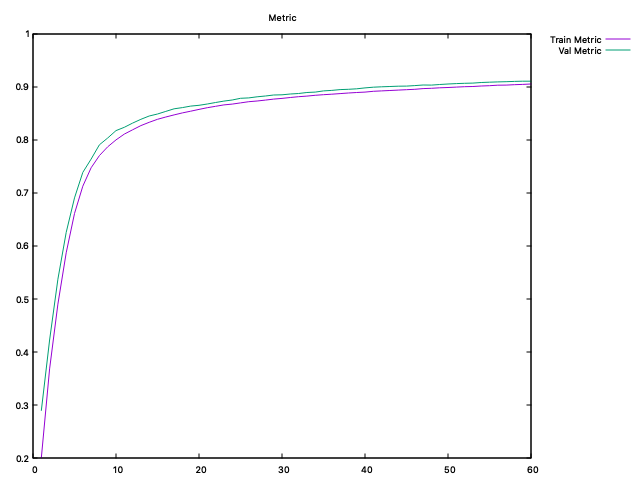
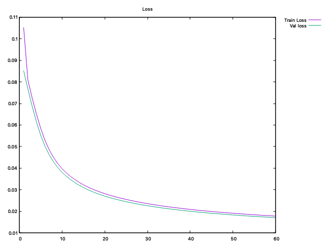

# CNet

Neural Network Implementation written in C (STD C11).
The main goal is to understand the artificial neural network architecture by building one from scratch and training over the MNIST dataset. As a separate goal, I tried to create the **cnet** interface as flexible as possible, with the possibility to work with several layers, activations and losses. 

## DISCLAIMER

This is not a serious project, nor it will be mantained. The objective was to understand the neural layers and that's all. [Here is a serious project](https://github.com/codeplea/genann) that can be used.

## MNIST

The [mnist folder](./mnist) contains code to test the cnet library over the [mnist dataset](http://yann.lecun.com/exdb/mnist/). It contains two main scripts: *train* and *predict*. The *train* file contains code to train the model, the output is be saved into [the mnist out folder.](./mnist/out), including the saved model and the history file (containing loss and accuracy). The *predict* file contains code to test the saved model over the test-set and creating a classification report and a confusion matrix, that can be visualized using the [gnuplot script](./plots/confusion_matrix.plt).

Currently, the model can reach *0.91* accuracy over the mnist test-set within 60 epochs (I haven't tried using more epochs yet).
These are the loss and accuracy for the previously mentioned scenario:

| accuracy | loss |
| --- | --- |
|  |  |

## BUILD

The generated files will be saved in the following folders:

- **bin/obj**: object files for library
- **bin/lib**: cnet static library
- **bin/exec**: all executable files

The [Makefile](Makefile) provides the following targets:

- **cnet**: Builds the cnet static library
- **integration-tests**: Builds a quick integration test
- **mnist-train**: Trains a model on the mnist dataset (see [the mnist section](#mnist))
- **mnist-predict**: Uses the saved model to predict over the mnist testset (see [the mnist section](#mnist))

## LIB

The project builds a static library that provides several functions, these will all start with the *cnet_* prefix and they can be found in the [cnet header](./cnet/include/cnet.h). The most important functions are:

- **cnet_init**: intialize a cnet model
- **cnet_free**: free the initialized memory for a cnet model
- **cnet_add**: adds a layer to the model
- **cnet_predict**: predict over a single sample
- **cnet_train**: trains the model over the given hyperparameters, this function also saves the history into a given file. This history can be displayed using the [metrics plot script](./plots/metrics.plt) using gnuplot.
- **cnet_save**: save the model into a given file
- **cnet_load**: load the model from a given file
